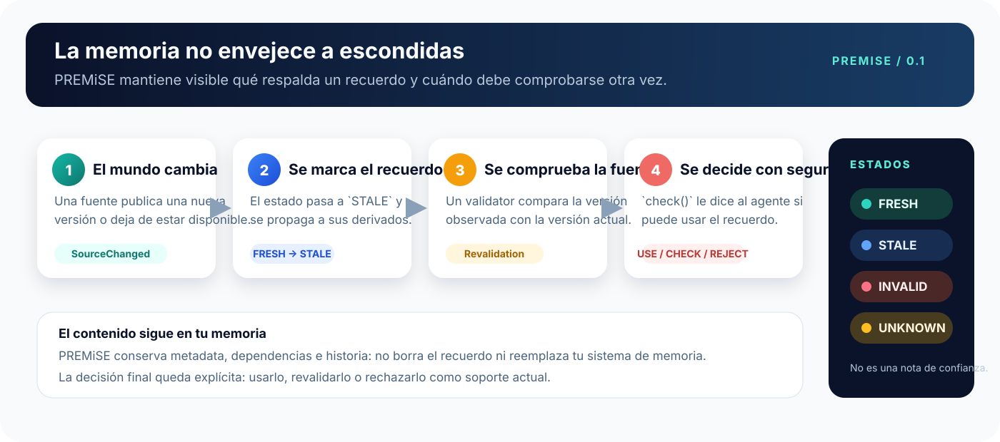

# PREMiSE Protocol

<p align="center">
  
</p>

<p align="center">
  <strong>La capa de validez para la memoria de los agentes.</strong><br>
  Cuando cambia el mundo, PREMiSE ayuda a saber qué recuerdos siguen siendo utilizables.
</p>

<p align="center">
  <a href="https://github.com/Dafenxz0/premise-protocol/actions/workflows/ci.yml"></a>
  <a href="https://github.com/Dafenxz0/premise-protocol/releases/tag/v0.1.0-rc.1"></a>
  
  
  
</p>

<p align="center">
  <a href="#premise-en-una-frase">Qué es</a> ·
  <a href="#cómo-funciona">Cómo funciona</a> ·
  <a href="#empezar-sin-complicaciones">Empezar</a> ·
  <a href="#resultados-reproducibles">Resultados</a> ·
  <a href="#para-quien-vaya-a-integrarlo">Integración</a>
</p>

> PREMiSE no sustituye a tu sistema de memoria. Guarda la información sobre su procedencia, su versión y su vigencia para que un agente no trate un recuerdo antiguo como si fuera actual.

## PREMiSE en una frase

Un agente puede recordar que **“la pull request #42 se puede fusionar”**. Pero después puede llegar un commit nuevo, fallar una comprobación o desaparecer la fuente original. PREMiSE registra ese cambio, lo propaga a los recuerdos que dependen de él y deja una decisión explícita:

- `FRESH`: se puede usar.
- `STALE`: hay que comprobarlo otra vez.
- `INVALID`: la evidencia demuestra que ya no es válido como soporte actual.
- `UNKNOWN`: no hay información suficiente para decidir.

Los estados hablan de la evidencia, no de la calidad del texto ni de una “nota de confianza”. Invalidar una memoria tampoco la borra: el contenido y su historia siguen perteneciendo a tu sistema de memoria.

## Cómo funciona



El protocolo conecta cuatro piezas sencillas:

| Pieza | En lenguaje normal |
| --- | --- |
| **Memoria** | Guarda el contenido y decide cómo recuperarlo. |
| **PREMiSE** | Guarda la evidencia, el estado, las dependencias y la historia. |
| **Validator** | Comprueba si la fuente sigue en la versión esperada. |
| **Agente o aplicación** | Usa `check()` para decidir si puede actuar con ese recuerdo. |

### Un ejemplo paso a paso

| Momento | Qué sabe el sistema | Resultado |
| --- | --- | --- |
| 1. Se observa la PR #42 en el commit `abc123` | La evidencia coincide con el recuerdo | `FRESH` |
| 2. La rama recibe un commit nuevo | El recuerdo podría haber quedado desactualizado | `STALE` |
| 3. Un validator comprueba la fuente | El nuevo estado ya no permite fusionar | `INVALID` |
| 4. El agente pregunta antes de actuar | PREMiSE devuelve una decisión explícita | Rechazar como soporte actual |

## Por qué existe

Sin un contrato común, cada memoria acaba resolviendo por separado problemas como:

- saber de qué fuente salió un recuerdo y cuándo se observó;
- detectar que una fuente cambió sin releerlo todo constantemente;
- propagar un cambio a una conclusión derivada, pero no a recuerdos que no dependen de ella;
- conservar una historia auditable sin presentar una evidencia invalidada como vigente;
- dar a un agente una decisión clara antes de usar un recuerdo.

PREMiSE estandariza esas reglas sin apropiarse del contenido, del retrieval, de los embeddings ni del framework de agentes.

## Qué incluye esta versión

La release `v0.1.0-rc.1` contiene:

- especificación, JSON Schemas y test vectors independientes del lenguaje;
- implementación TypeScript de referencia con grafo de dependencias, estados, eventos, replay y revalidación;
- sidecar SQLite para metadata e historia;
- validators de filesystem y Git;
- límites de integración para adapters OpenAI y MCP;
- runner de conformance para ejecutar los mismos casos en otras implementaciones;
- benchmark reproducible con escenarios de filesystem, Git y GitHub-like;
- ejemplos mínimos de una memoria genérica, OpenAI y MCP;
- CI reproducible con Node.js 24 y pnpm 10.

## Resultados reproducibles

Los números de abajo salen de los artefactos versionados en este repositorio, no de una afirmación manual:

- **16/16** vectores de conformance ejecutados y aprobados.
- **40** escenarios, **10** controles, **5** ablaciones y **40** trazas JSON.
- **95%** de éxito en los escenarios reparables del benchmark; los casos de eliminación o ausencia permanecen bloqueados cuando no hay una reparación posible.
- El contrato de adapters pasa la verificación cruzada.

Artefactos:

- [Informe de conformance](./conformance-report.json)
- [Resultados del benchmark](./results.json)
- [Resumen de verificación](./summary.md)
- [Trazas por escenario](./traces/)

## Investigación hacia la siguiente versión

La siguiente iteración ya incluye una medición emparejada para no confundir una demo con una mejora real:

- **Sin protocolo**: en 21 episodios con cambios, usa el recuerdo sin comprobar y alcanza un `unsafeActionRate` del **100%**.
- **Con PREMiSE**: llega a **0%** de acciones inseguras, recupera el **100%** de los casos reparables, rechaza el **100%** de los casos no reparables y conserva la historia.
- En contexto grande, una cadena de **25.000** memorias pasó de unos **64 s** a unos **0,23 s** después de eliminar el chequeo de ciclos innecesario al añadir nodos nuevos. Fanout y shared-support también terminan por debajo de un segundo en la medición local.

Estos resultados son locales y reproducibles; no son una promesa de producción. La auditoría del benchmark histórico queda en `PROVISIONALLY-VALID`: ya exporta decisiones y costes observables, pero conserva límites explícitos sobre hardware, payload real y validators externos.

```bash
pnpm benchmark:compare       # protocolo vs. baseline sin protocolo
pnpm benchmark:context       # 1k y 5k nodos, apto para CI
pnpm benchmark:context:full  # 1k, 5k, 10k y 25k; stress test
pnpm benchmark:evaluate      # auditoría paired y gate de regresión
pnpm benchmark:next          # ejecuta la campaña completa
```

Resultados de investigación: [`comparative-bench`](./benchmarks/comparative-bench/), [`long-context-bench`](./benchmarks/long-context-bench/) y [`evaluation`](./benchmarks/evaluation/).

## Empezar sin complicaciones

Necesitas Node.js 24 y pnpm 10. Después:

```bash
git clone https://github.com/Dafenxz0/premise-protocol.git
cd premise-protocol
pnpm install --frozen-lockfile
pnpm build
pnpm test
```

Para ejecutar todas las comprobaciones del proyecto:

```bash
pnpm test:properties
pnpm conformance
pnpm benchmark:smoke
pnpm benchmark -- --runner minimal --suite v0.1
pnpm examples:verify
pnpm artifacts:generate
```

`pnpm artifacts:generate` vuelve a crear el informe de conformance, los resultados del benchmark, el resumen y las trazas. Si cambia una afirmación del proyecto, ese es el comando que debe respaldarla.

## Dónde está cada cosa

| Ruta | Para qué sirve |
| --- | --- |
| [`spec/`](./spec/) | Contrato normativo, schemas y casos compartidos. |
| [`docs/`](./docs/) | Explicación del problema, conceptos y arquitectura. |
| [`packages/protocol-types`](./packages/protocol-types/) | Tipos y validación de envelopes y eventos. |
| [`packages/reference-ts`](./packages/reference-ts/) | Implementación TypeScript de referencia. |
| [`packages/index-sqlite`](./packages/index-sqlite/) | Persistencia de metadata e historia con SQLite. |
| [`packages/validator-filesystem`](./packages/validator-filesystem/) | Comprobación de archivos locales. |
| [`packages/validator-git`](./packages/validator-git/) | Comprobación de referencias Git. |
| [`packages/adapter-openai`](./packages/adapter-openai/) | Frontera de integración para memorias OpenAI. |
| [`packages/mcp-bridge`](./packages/mcp-bridge/) | Suscripciones y revalidación sobre MCP. |
| [`packages/conformance`](./packages/conformance/) | Valida y ejecuta los test vectors. |
| [`benchmarks/`](./benchmarks/) | Motor, escenarios, controles y métricas. |
| [`examples/`](./examples/) | Integraciones pequeñas que se pueden ejecutar. |
| [`assets/`](./assets/) | Logo y diagrama visual del protocolo. |

## Para quien vaya a integrarlo

La integración no obliga a migrar una memoria existente. El adapter conserva su contenido y asocia cada recuerdo con un **validity envelope**: una ficha que indica qué fuente lo respalda, qué versión se observó, qué política aplica y de qué otros recuerdos depende.

El flujo conceptual es:

```text
registrar recuerdo + evidencia
          ↓
avisar de un cambio o dejar que expire un TTL
          ↓
revalidar con un validator
          ↓
consultar check() antes de usarlo
```

La implementación de referencia está disponible en [`@premise/reference-ts`](./packages/reference-ts/), y los ejemplos ejecutables están en [`examples/`](./examples/). La semántica completa está en la [especificación v0.1](./spec/premise-v0.1.md).

<details>
<summary>Vocabulario técnico, explicado rápido</summary>

| Término | Significado |
| --- | --- |
| `memoryId` | Identificador estable de un recuerdo. |
| `provenance` | La fuente y la observación que respaldan el recuerdo. |
| `version.token` | La versión observada; PREMiSE la trata como un valor opaco. |
| `dependsOn` | Recuerdos que sostienen una conclusión derivada. |
| `SourceChanged` | Evento que indica que una fuente puede haber cambiado. |
| `check()` | Pregunta que devuelve si un recuerdo se puede usar, debe revalidarse o debe rechazarse. |

</details>

## Límites de v0.1

PREMiSE no pretende ser una base de datos vectorial, un sistema de embeddings, un motor de retrieval, una memoria principal, un dashboard, un servicio cloud ni una autoridad universal sobre la verdad. Tampoco incluye un adapter real de GitHub en esta versión: los escenarios `github-like` del benchmark son deterministas y locales.

## Preguntas frecuentes

**¿PREMiSE almacena el texto del recuerdo?**

No. La memoria existente conserva el contenido. PREMiSE conserva la ficha de validez y su historia.

**¿PREMiSE decide qué es verdad?**

No. Un validator comprueba una fuente concreta y devuelve un resultado. PREMiSE aplica las reglas de transición y propagación de forma consistente.

**¿Tengo que usar una memoria o un proveedor concreto?**

No. El protocolo define el comportamiento y el repositorio incluye adapters y ejemplos para mostrar cómo conectarlo.

**¿Qué pasa cuando algo queda invalidado?**

No se borra automáticamente. Se conserva el contenido y la historia, pero `check()` impide presentarlo como soporte actual.

## Estado del proyecto

`v0.1.0-rc.1` es un release candidate en un repositorio privado. La especificación, la implementación de referencia, los adapters, los ejemplos, los benchmarks y la CI están versionados juntos para que cada cambio pueda comprobarse de forma reproducible.

Este repositorio no incluye una licencia pública por diseño.
