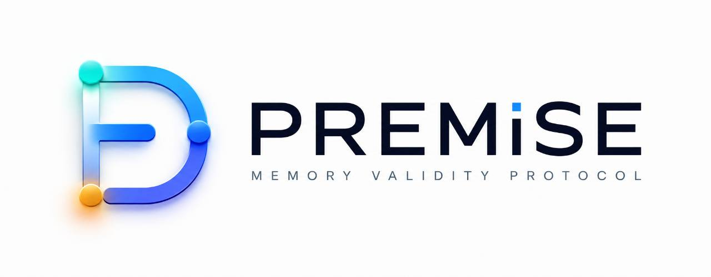
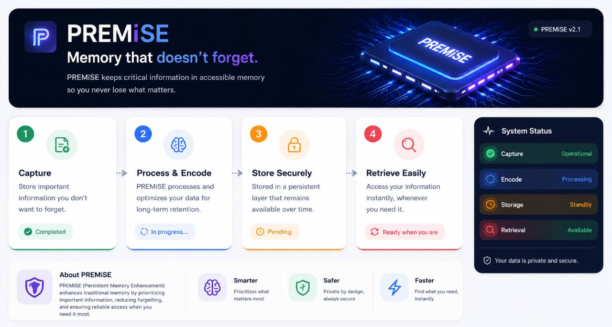

# PREMiSE



## Keep agent decisions coherent with a changing world

PREMiSE is an open protocol and runtime for agents that read external state, reason about it, and then act. It records which evidence a decision depends on, detects when that evidence changes, and prevents a stale decision from being used silently.

PREMiSE is not a vector database, an embedding system, a retrieval engine, a primary memory, a dashboard, a cloud service, or an authority on truth. It is the coherence layer between an agent and the systems whose state can change while the agent is working.



## PREMiSE in one sentence

> PREMiSE lets an agent know when the facts behind its next action are still current—and makes it re-check them when they are not.

## How it works

```text
observe → record evidence and version → derive a decision → check before acting
                                                     ↓
                                    fresh: use · stale: revalidate · invalid: reject
```

The protocol is deliberately separate from the source system. GitHub, a file, a database row, or an API remains the owner of its data. PREMiSE stores the evidence, versions, dependencies, and receipts needed to make a safe decision at the boundary where an agent acts.

### A small example

1. An agent reads `config@v41` and prepares a change.
2. Another process publishes `config@v42`.
3. PREMiSE marks the dependent decision stale.
4. The agent revalidates before writing, or the guarded action is rejected.

The important behavior is not that PREMiSE remembers more. It is that the agent cannot silently treat an old observation as current.

## What is in this repository today

The repository contains the protocol contracts, a TypeScript runtime, reference implementations, stores and adapters, conformance vectors, and an evidence-driven benchmark lab.

| Area | Current state |
| --- | --- |
| Protocol contracts | `premise/1`, `premise/1.1`, and PREMiSE NEXT portable vectors |
| Runtime | TypeScript runtime with dependency propagation, revalidation, receipts, idempotency, and guarded actions |
| Stores | In-memory, SQLite, and PostgreSQL-compatible packages |
| Adapters | Filesystem, Git/GitHub-like, HTTP, webhook, and protocol examples |
| Conformance | Independent Python reference plus 24 portable PREMiSE NEXT vectors; 15 shared semantic vectors also run in TypeScript |
| Evidence | Deterministic experiments and their limitations are indexed in [`docs/evidence`](docs/evidence/README.md) |
| Release status | Research/engineering candidate; not a universal GA claim |

## Quick start

Requirements: Node.js 24 and pnpm 10.

```bash
corepack enable
pnpm install --frozen-lockfile
pnpm build
pnpm test
```

The smallest useful integration is: observe a source, attach its revision to a premise, derive the action, call `check` immediately before the side effect, and perform the connector's conditional write. Start with [`@premise/runtime-core`](packages/runtime-core/README.md), then read the [integration guide](docs/api-v2.md). `PremiseSession` and the guarded-tools contract are available from the runtime package; connector-specific authorization and conditional writes remain application responsibilities.

The repository includes an executable quickstart rather than a conceptual snippet:

```bash
pnpm example:quickstart
```

The exact source is [`examples/quickstart.mjs`](examples/quickstart.mjs). It uses the current `PremiseSession` contract, verifies a `USABLE` decision, and performs the final action through a conditional adapter callback.

The exact adapter contract is intentionally explicit: a protocol receipt is not a substitute for the source system's CAS, ETag, transaction, or permission check.

## Evidence, not promises

PREMiSE is evaluated against changing sources, not only static examples. The benchmark lab measures safety, freshness, request work, reads, latency, and cost per successful fresh action. It also records negative and inconclusive results.

The current NEXT evidence includes a deterministic 100-worker coherence storm
with 0 stale actions accepted and 0 cross-tenant joins, PostgreSQL leases, and a
durable validation-flight adapter with atomic leader/follower claims,
monotonic fencing and forced tenant RLS. The storm is an in-memory contract
smoke, and PostgreSQL integration is opt-in; none of these is a distributed
capacity or universal production claim.

The public evidence index is the right place to start: [`docs/evidence/README.md`](docs/evidence/README.md). It separates measured behavior from planned work and keeps benchmark archaeology out of this page.

The current evidence does **not** justify claims that PREMiSE is universally safer, cheaper, production-ready for every connector, or equivalent to an independent external evaluation. In particular, the long-horizon work shows why bounded operational state and durable audit history must be designed separately; the compaction experiment remains a no-go until its invariants are proven.

## Documentation

- [Concepts](docs/concepts.md)
- [Protocol and versioning](docs/versioning.md)
- [Runtime architecture](docs/architecture.md)
- [API and integration](docs/api-v2.md)
- [Benchmark evidence](docs/evidence/README.md)
- [Operations and deployment](docs/deployment-v2.md)
- [Security boundaries](docs/security-v2.md)
- [Protocol specification: premise/1](spec/premise-1/README.md)
- [Protocol specification: premise/1.1](spec/premise-1.1/README.md)

## Scope and non-goals

PREMiSE does not decide whether a source is morally, legally, or semantically true. It does not replace source-of-truth systems, solve retrieval, or make an agent's plan correct by itself. It provides a deterministic coherence boundary: the decision may proceed only when its recorded premises still satisfy the policy required by the action.

The next engineering milestone is connector-backed evidence and independent
failure-injection campaigns: real PostgreSQL flight execution, distributed
capacity and crash recovery, external holdout evaluation, and provider-cost
measurement. See
[`docs/premise-next-status.md`](docs/premise-next-status.md) and
[`docs/evidence/README.md`](docs/evidence/README.md) for the status of each
piece.

## Contributing

Run the relevant package tests and the full validation suite before opening a pull request. New benchmark claims must include the workload manifest, evaluator rules, raw trace digest, and any negative result. Do not commit generated campaign artifacts unless a document explicitly treats them as a fixture.

```bash
pnpm build
pnpm test
pnpm lint
```

PREMiSE is currently an engineering/research project. If you need a connector, store, or deployment guarantee that is not represented by a passing conformance test and published evidence, treat it as work to validate—not as an existing promise.
