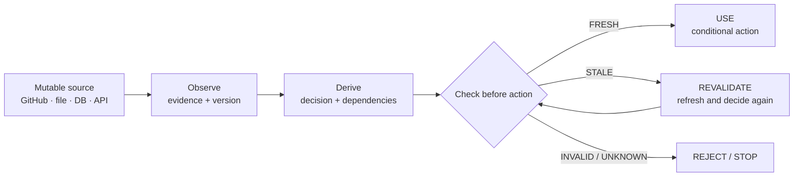

<div align="center">
  

  <h1>Keep agent decisions coherent with a changing world.</h1>

  <p>
    PREMiSE is a protocol and runtime that records the evidence behind an agent decision,
    watches the versions and dependencies it relies on, and stops stale actions at the boundary.
  </p>

  <p>
    <a href="https://github.com/Dafenxz0/premise-protocol/actions/workflows/ci.yml?query=branch%3Amain"></a>
    <a href="https://nodejs.org/en/download"></a>
    <a href="https://github.com/Dafenxz0/premise-protocol/releases"></a>
    <a href="https://github.com/Dafenxz0/premise-protocol/blob/main/spec/premise-1/README.md"></a>
  </p>
</div>

<p align="center">
  
</p>

<p align="center">
  <a href="#how-it-works">How it works</a> ·
  <a href="#install-in-two-minutes">Install</a> ·
  <a href="#what-is-measured">Evidence</a> ·
  <a href="#develop-the-repository">Develop</a> ·
  <a href="docs/evidence/README.md">Evidence index</a>
</p>

## PREMiSE in one sentence

> PREMiSE lets an agent know whether the facts behind its next action are still current — and makes it re-check them when they are not.

The source system remains the source of truth. GitHub, a file, a database row, or an API still owns its data; PREMiSE supplies the coherence boundary between that mutable world and the agent's final action.

## The product path: observe → prepare → guard → commit

The smallest useful PREMiSE integration is a guarded change, not a new memory
database. An adapter observes a source and its version; the agent can reason for
as long as it needs; the final write is accepted only through the source's own
conditional boundary.

```ts
const session = premise.session({ tenant: "acme", adapter });
const prepared = await session.prepareAction({
  source: "github://acme/service/pull/42",
  action: { type: "merge" }
});

const outcome = await prepared.commitIfFresh();
if (outcome.status === "blocked") {
  console.log(outcome.code); // e.g. STALE_SOURCE
  // Observe again and make a new decision. Do not replay the old premise.
}
```

`guardedWrite()` is the one-shot form. Both paths fail closed when the adapter
cannot provide an atomic conditional action. See the [product golden path](docs/product-golden-path.md)
and open the dependency-free [Agent Change Control demo](apps/agent-change-control/index.html)
to see the stale-write boundary in plain language.

## Install in two minutes

PREMiSE is host-agnostic. You do not need to install this monorepo, a
database, or a cloud service to give an agent the protocol workflow and its
standalone MCP tools.

```bash
git clone --depth 1 https://github.com/Dafenxz0/premise-protocol.git .premise-source
node .premise-source/plugins/premise-codex/install.mjs --agent all --project .
node .premise-source/plugins/premise-codex/install.mjs --check --agent all --project .
```

| Host | Install target | What you get |
| --- | --- | --- |
| Codex | `--agent codex` | `.agents/skills/premise` plus the standalone MCP entry |
| Claude Code | `--agent claude-code` | managed `CLAUDE.md` import plus `.mcp.json` |
| Other MCP-compatible agents | `--agent generic` | `AGENTS.md` guidance plus `.premise/premise.mcp.json` |
| All of the above | `--agent all` | the complete portable kit |

The default is zero-config `SELFTEST`: it verifies that the copied server
starts and responds, but it is not a local memory store or a truth oracle. For
remote mode, set `PREMISE_MODE`, `PREMISE_BASE_URL`, `PREMISE_TENANT` and
`PREMISE_TOKEN` in the agent process environment. Never put credentials in
`.mcp.json`. See the [agent installation guide](docs/agent-installation.md)
for Windows PowerShell, remote mode and uninstall details.

## Why this matters

An agent can read `config@v41`, spend several seconds reasoning, and then attempt a write after another process has already published `config@v42`. Ordinary memory can preserve the old observation perfectly and still make the action unsafe.

PREMiSE attaches the observation and its version to the decision. Immediately before the side effect, the protocol checks that the premise is still usable. If the world moved, the agent revalidates or stops instead of silently acting on an obsolete plan.

<table>
  <tr>
    <td width="33%" valign="top">
      <h3>01 · Observe</h3>
      Read a source and record the evidence, version, validator and scope that matter for the decision.
    </td>
    <td width="33%" valign="top">
      <h3>02 · Reason</h3>
      Derive a premise or dependency graph. The agent can work normally while the outside world continues to change.
    </td>
    <td width="33%" valign="top">
      <h3>03 · Guard</h3>
      Check freshness at the action boundary. A stale, invalid or unknown premise cannot pass silently.
    </td>
  </tr>
</table>

## How it works



The protocol keeps the important state small and explicit:

| State | Meaning | Default decision |
| --- | --- | --- |
| `FRESH` | The recorded evidence still satisfies the policy. | `USE` |
| `STALE` | A dependency, version or event says the decision needs checking again. | `REVALIDATE` |
| `INVALID` | The premise no longer describes the source or its identity. | `REJECT` |
| `UNKNOWN` | The source could not be checked with enough authority. | `REJECT` |

<p align="center">
  
</p>

<p align="center"><sub>One boundary, many sources: the connector owns the data and the conditional write; PREMiSE owns the decision's validity.</sub></p>

## What PREMiSE is — and is not

| PREMiSE is | PREMiSE is not |
| --- | --- |
| A portable coherence protocol for decisions that depend on mutable state | A vector database or embedding system |
| A TypeScript runtime with guarded actions, receipts, leases and dependency semantics | A retrieval engine or primary memory replacement |
| A place to express version, authorization, policy and revalidation boundaries | A dashboard, cloud service or universal truth authority |
| A conformance surface with independent Python reference vectors | A guarantee that an agent's plan is semantically correct |

## What is in this repository today

| Area | What you can use now |
| --- | --- |
| Protocol contracts | `premise/1`, `premise/1.1` and the portable PREMiSE NEXT semantic slice |
| Runtime | TypeScript runtime with dependency propagation, revalidation, receipts, idempotency, leases and guarded actions |
| Session and SDK | `PremiseSession`, the public Adapter SDK and an executable quickstart |
| Stores and adapters | In-memory, SQLite and PostgreSQL-compatible stores; filesystem, Git/GitHub-like, HTTP and webhook adapters |
| Product surface | `prepareAction()`, `guardedWrite()` and a dependency-free Agent Change Control demo |
| Conformance | Independent Python reference, 24 Python NEXT cases and 15 shared TypeScript semantic vectors |
| Evidence lab | Deterministic benchmark campaigns for safety, freshness, work, latency and cost accounting |
| Release status | `2.0.0-rc.1` engineering candidate — not a universal GA claim |

## What is measured

The table below is a snapshot of the deterministic local coherence-storm runner with the default seed `premise-next-storm-20260814`. Reproduce it with [`node benchmarks/premise-next/storm/runner.mjs`](benchmarks/premise-next/storm/README.md). These numbers are useful for checking invariants in this repository; they are not a distributed capacity result, a provider-cost study or a promise that every connector behaves identically.

| Check | Latest recorded result | What it proves |
| --- | ---: | --- |
| Coherence storm | 100 logical workers | The coordination path is exercised under concurrent contention |
| Physical validations | 111 | The fixed storm seed and phase mix produce bounded/coalesced work in the tested runtime |
| Joined validations | 689 | Compatible followers can share validation work under the tested scopes |
| Stale actions accepted | 0 | The tested guard did not allow a stale action through |
| Cross-tenant joins | 0 | The tested sharing scope kept tenants isolated |
| Old-fence commits | 0 | The tested fencing path rejected superseded commits |
| NEXT semantic vectors | 15 shared TS + 24 Python cases | The published semantic slice agrees across the two references |

### Mutable-agent comparison (internal candidate evidence)

The following campaign used two isolated Codex/Luna Max agents on the same
SkillProof task, then a blind evaluator, plus six separate mutation worlds with
300 deterministic tasks. It is deliberately shown as a safety/cost trade-off:
the result supports a strong freshness and action-safety signal, but it does
**not** yet support a claim that PREMiSE uses fewer raw requests.

| Arm | Changed/error decisions | Unsafe stale actions | Safe completions | Tool calls | Requests / safe completion |
| --- | ---: | ---: | ---: | ---: | ---: |
| **PREMiSE + isolated LLM** | **162/162 · 100%** | **0/113 · 0%** | **113/113 · 100%** | 815 | 7.21 |
| Baseline memory | 0/162 · 0% | 162/275 · 58.91% | 113/275 · 41.09% | **575** | **5.09** |

**What this says:** PREMiSE prevented every unsafe action in this campaign and
correctly handled every changed or errored source. The baseline used 29.45%
fewer raw calls because it skipped validation and guards, but it acted on stale
state. This is a promising safety result, not yet an efficiency victory. The
full methodology and claim boundary are in the [mutable-agent campaign
record](docs/evidence/mutable-agent-campaign-2026-08-15.md).

For the assumptions, seeds, limitations and negative results, start with the [evidence index](docs/evidence/README.md) and [PREMiSE NEXT status](docs/premise-next-status.md). The current evidence does **not** justify claims that PREMiSE is universally safer, cheaper, production-ready for every connector, or independently validated by an external holdout.

## Develop the repository

Requirements: Node.js 24 and pnpm 10.

### Use the public SDK

The public integration surface is @premise/sdk, an ESM-only Node 24 client
for the premise/2 HTTP API. It has no runtime dependency on this monorepo and
is tested in three external projects without workspaces:

    npm install @premise/sdk

The registry publication is still a separate release step for this candidate.
The repository gate already builds the package, creates a tarball, installs it
with npm in clean GitHub-like, REST and filesystem consumers, and records the
registry status as NOT_RUN until a release is intentionally published. See the
[adoption and reality wave](docs/adoption-reality-wave.md) for the exact claim
boundary.

For agents working with mutable sources, the repository also ships a
[PREMiSE Skill](.agents/skills/premise/SKILL.md) and a source
[Codex plugin](plugins/premise-codex/README.md). They teach the workflow; the
runtime and connector still enforce authorization and conditional writes.
The plugin includes a dependency-free MCP launcher that defaults to SELFTEST
mode and can use REMOTE mode with `PREMISE_BASE_URL`; its copied-install gate
is documented in the [isolated Codex/Luna experiment](docs/codex-luna-isolated-experiment.md).

```bash
corepack enable
pnpm install --frozen-lockfile
pnpm build
pnpm test
```

Run the smallest end-to-end example:

```bash
pnpm example:quickstart
```

The source is [`examples/quickstart.mjs`](examples/quickstart.mjs). It uses the current `PremiseSession` contract, verifies a `USABLE` decision, and finishes through a conditional adapter callback. The connector remains responsible for authorization and its atomic write (CAS, ETag, transaction or equivalent).

## A minimal integration shape

```ts
const session = premise.session({ tenant: "acme", adapter });
const source = await session.observe("github://acme/config");
const plan = await session.derive({
  claim: "The config is ready to publish",
  from: [source],
});

const check = session.check(plan);

if (check.decision === "USABLE") {
  await session.act({ premise: plan, action: { type: "publish-config" } });
}
```

This sketch shows the boundary, not a universal connector API. See the [API guide](docs/api-v2.md), [session API](docs/session-api.md) and [HTTP adapter example](examples/sdk-http/README.md) for the exact contracts.

## Explore the project

<table>
  <tr>
    <td width="50%" valign="top">
      <h3>Understand the protocol</h3>
      <ul>
        <li><a href="docs/concepts.md">Core concepts</a></li>
        <li><a href="docs/versioning.md">Evidence and versioning</a></li>
        <li><a href="docs/protocol/premise-1.md">PREMiSE/1 contract</a></li>
        <li><a href="docs/protocol/premise-1.1.md">PREMiSE/1.1 contract</a></li>
      </ul>
    </td>
    <td width="50%" valign="top">
      <h3>Build and evaluate</h3>
      <ul>
        <li><a href="docs/api-v2.md">Runtime and integration API</a></li>
        <li><a href="docs/product-golden-path.md">Product golden path</a></li>
        <li><a href="apps/agent-change-control/index.html">Agent Change Control demo</a></li>
        <li><a href="docs/agent-installation.md">Install for Codex, Claude Code and MCP hosts</a></li>
        <li><a href="docs/evidence/README.md">Evidence index</a></li>
        <li><a href="docs/benchmarks/premisebench-agent.md">Agent benchmark methodology</a></li>
        <li><a href="conformance/README.md">Conformance runner</a></li>
      </ul>
    </td>
  </tr>
</table>

## Scope and non-goals

PREMiSE does not decide whether a source is morally, legally or semantically true. It does not replace source-of-truth systems, solve retrieval, or make an agent's plan correct by itself. It provides a deterministic coherence boundary: a decision may proceed only when its recorded premises still satisfy the policy required by the action.

The next evidence gate is connector-backed and independent: credentialed PostgreSQL and multi-process crash recovery, durable random-access journal storage, the remaining cross-language guarded-action vectors, external holdouts and provider-cost campaigns. Anything requiring credentials or external infrastructure must remain explicitly `skipped` until its infrastructure and manifests are present.

## Contributing

Run the relevant package tests and the full validation suite before opening a pull request. New benchmark claims should include the frozen workload and seed manifest, adapter/runtime version, evaluator rules, raw trace digest, denominators and negative or inconclusive results.

```bash
pnpm build
pnpm test
pnpm conformance:next
```

Generated campaign artifacts belong outside the source tree unless a document explicitly treats them as a fixture. If a connector, store or deployment guarantee is not represented by a passing conformance test and published evidence, treat it as work to validate — not as an existing promise.
