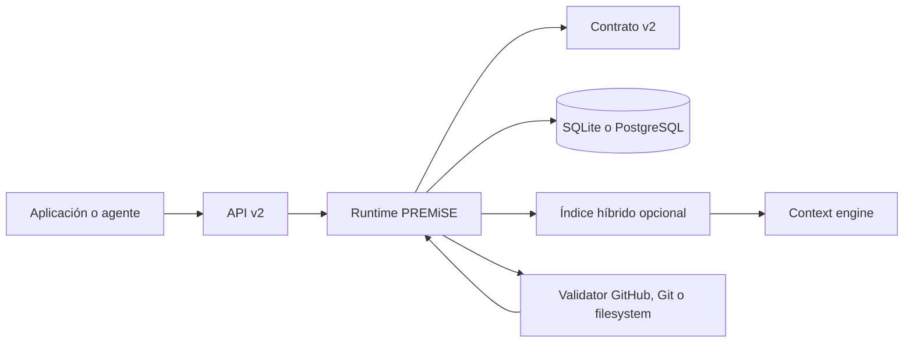

# PREMiSE v2: arquitectura explicada

PREMiSE v2 no intenta convertirse en “la memoria” de una aplicación. Es una capa que acompaña a la memoria que ya tengas y responde a una pregunta concreta: **¿puedo usar este recuerdo como soporte de una acción ahora mismo?**

## Las cuatro capas

1. **Contrato.** Define evidencias, confianza declarada, conflictos, ventanas temporales, dependencias, eventos y tenancy. No decide por sí solo que algo sea “verdad”.
2. **Runtime.** Aplica el contrato: registra recuerdos, propaga cambios por el grafo, obliga a revalidar y conserva una historia replayable.
3. **Integraciones.** SQLite es una opción local durable; PostgreSQL tiene un adapter driver-neutral; GitHub usa API REST real con ETag, retries, rate limits y webhooks firmados. El retrieval y el contexto son componentes opcionales.
4. **Evaluación.** Compara contra lectura directa y caches simples con el mismo workload. Guarda respuestas, latencias, peticiones y trazas por tarea.

## Qué pasa cuando una fuente cambia

El cambio no borra el recuerdo. PREMiSE marca como `STALE` la evidencia afectada y recorre sus dependientes. Antes de que un agente actúe, `check()` devuelve `USABLE`, `REVALIDATE` o `REJECT`. Solo un validator que vuelva a observar la fuente puede devolverlo a `FRESH`.

## Seguridad y límites

El aislamiento mínimo es por `tenantId`; un runtime no puede leer recuerdos de otro tenant. Las firmas de v2 son declaraciones que deben verificarse en una capa de confianza externa. Los secretos de GitHub se inyectan en runtime y no aparecen en errores ni trazas.

La implementación no incluye un proveedor de embeddings, una base vectorial gestionada, un servicio cloud, un dashboard alojado ni una autoridad de verdad. El índice híbrido local y la API HTTP sirven como piezas de referencia para integrarlos, no como una redefinición del protocolo.
